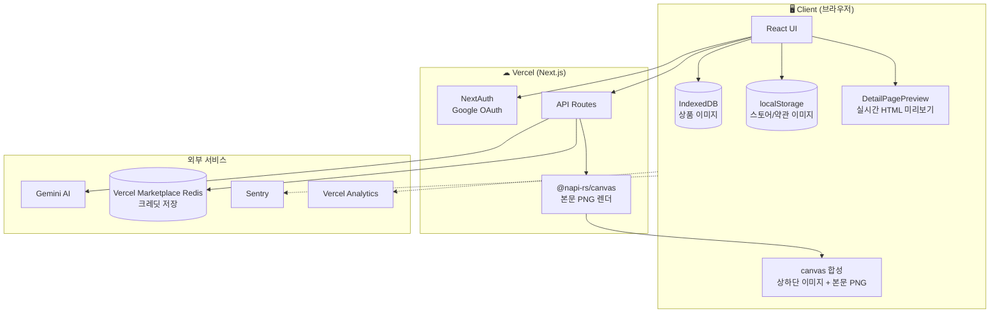

# PageCraft 아키텍처

> 현재 실제 구현 기준 (데모 MVP 버전)

---

## 1. 전체 구조



---

## 2. 기술 스택

| 레이어 | 기술 | 비고 |
|--------|------|------|
| 프레임워크 | Next.js 16 (App Router) | 프론트 + API Routes 통합 |
| 언어 | TypeScript strict | 전체 적용 |
| 스타일 | Tailwind CSS v4 | `@theme` 디자인 토큰 |
| 상태 관리 | Zustand v5 | persist + 수동 hydrate |
| 인증 | NextAuth v4 + Google OAuth | JWT 세션 쿠키 |
| AI 텍스트 | Gemini 2.5 Flash | 통합 생성 (content + titles + tags) |
| AI 이미지 | Gemini 2.5 Flash Image | 모델 생성, 배경 제거 |
| 서버 렌더링 | @napi-rs/canvas | 본문 PNG, 한글 폰트 보장 |
| 크레딧 저장 | Vercel Marketplace Redis (ioredis) | `KV_REDIS_URL` TCP 연결 |
| 이미지 저장 | IndexedDB (idb 래퍼) | 용량 무제한 |
| 에러 모니터링 | Sentry v10 | `instrumentation-client.ts` |
| 배포 | Vercel | main 자동 배포 |

---

## 3. 렌더링 전략 (하이브리드)

실시간 미리보기는 HTML로, PNG 다운로드는 서버+클라이언트 합성.

### 3.1 미리보기 (클라이언트)
- `DetailPagePreview.tsx` — 800px 고정 React 컴포넌트
- `generatedContent` 변경 시 자동 리렌더링
- 이미지는 IndexedDB에서 원본 그대로 사용

### 3.2 PNG 다운로드 (하이브리드)
```
서버: /api/render → @napi-rs/canvas → 본문만 PNG (헤더~가격푸터)
  ↓
클라이언트: canvas로 세로 합성
  [스토어 소개 원본] + [본문 PNG] + [약관 원본]
```

**이유**
- 본문(한글 텍스트 많음) → 서버 렌더로 폰트 품질 보장
- 상하단 이미지 → 클라이언트에서 원본 그대로 (재압축 없음)
- Vercel body 4.5MB 제한 회피 (상하단 이미지 서버 전송 안 함)

---

## 4. AI 통합 생성 플로우

```
상세페이지 생성 버튼
  ↓
클라이언트: 이미지 5장 400px/0.5 품질 압축 (compressForAI)
  ↓
POST /api/ai/copy
  ↓
requireAuth('generate') — 인증 + 원자 INCRBY 선차감 (1 크레딧)
  ↓ (크레딧 부족 시 429 + 초기화일 안내)
ai.service.generateAll() — Gemini 통합 프롬프트
  → content + titles 5개 + tags 20개
  ↓
safeParseJSON — 깨진 JSON 보정
  ↓
성공: 응답 반환 / 실패: refundOnFailure(DECRBY 환불) + 500
  ↓
클라이언트: editorStore에 분배 + usageStore.fetchUsage()
```

### 이미지 압축 분기 (용도별)
| 함수 | 해상도/품질 | 용도 | 압축 이유 |
|------|------------|------|-----------|
| `compressForAI` | 400px / 0.5 | 텍스트 분석 (AI 통합 생성) | Gemini는 내용만 파악 → 작게 |
| `compressForImageGen` | 1024px / 0.9 | 이미지 생성/배경제거 | Gemini 출력 품질 보존 |
| `compressForRender` | 780px / 0.75 | 서버 PNG 렌더 | Vercel 4.5MB 제한 대응 |

---

## 5. 크레딧 시스템

### 구조
- **월 500 크레딧**, KST 매달 1일 00:00 초기화
- 기능별 차등: 상세 1 / 이미지 5 / 배경제거 5
- Redis TTL 32일 자동 만료

### 원자 소비 (Atomic Consumption)
동시 요청 race condition 방지를 위해 **Redis INCRBY + 롤백** 방식 사용:

```ts
// lib/rateLimit.ts — consumeCreditsAtomic
const newValue = await r.incrby(key, cost)        // 원자 증가
if (newValue > MONTHLY_CREDITS) {
  await r.decrby(key, cost)                       // 한도 초과 시 롤백
  return { allowed: false, ... }
}
return { allowed: true, remaining: LIMIT - newValue }
```

- 100명 동시 요청에도 **race condition 없이** 정확한 차감
- API 실패 시 `refundCredits()`가 `DECRBY`로 자동 환불
- 로직은 `requireAuth(type)` + `refundOnFailure()` 헬퍼로 래핑

### 저장소 키
```
credits:{userId}:{YYYY-MM} = 이번 달 누적 사용량
```

### 폴백
- `KV_REDIS_URL` 없으면 메모리 Map (개발용, 서버 재시작 시 초기화)
- 폴백도 동일하게 원자 패턴 유지 (단일 프로세스에서는 자명)

### 관리자
- `ADMIN_EMAILS` 쉼표 구분 이메일 → 크레딧 무제한 (Redis 기록 스킵)

---

## 6. 저장소 전략

| 데이터 | 저장소 | 이유 |
|--------|--------|------|
| 상품 이미지 | IndexedDB | sessionStorage 5MB 제한 초과 |
| 스토어/약관 이미지 | localStorage | 재사용 빈도 높음, 영구 보존 |
| 제품 정보 | sessionStorage (zustand) | 세션 중 유지 |
| AI 생성 결과 | sessionStorage (zustand) | 세션 중 유지 |
| 유저 크레딧 | Vercel Marketplace Redis | 서버리스 인스턴스 간 공유 |
| 세션 쿠키 | NextAuth JWT | HTTP-only 암호화 |

---

## 7. 인증 플로우

```
유저 첫 접속 → / 페이지
  ↓
"Google 로그인" 클릭 → signIn('google')
  ↓
Google OAuth → /api/auth/callback/google
  ↓
NextAuth JWT 세션 쿠키 발급 → /product/new 리다이렉트
  ↓
이후 API 호출에 쿠키 자동 포함
  → getServerSession으로 서버 검증
```

### 개발 모드 스킵
```env
SKIP_AUTH=true                 # 서버 API 인증 스킵
NEXT_PUBLIC_SKIP_AUTH=true     # 클라이언트 체크 스킵
```

---

## 8. API 라우트 요약

| 경로 | 메서드 | 용도 | 크레딧 |
|------|--------|------|-------|
| `/api/ai/copy` | POST | 통합 AI 생성 | 1 |
| `/api/image/generate` | POST | AI 모델 이미지 | 5 |
| `/api/image/bg-remove` | POST | 배경 제거 | 5 |
| `/api/render` | POST | PNG 본문 렌더 | 0 |
| `/api/usage` | GET | 크레딧 조회 | 0 |
| `/api/market/suggest` | GET | 쿠팡 인기 검색어 | 0 |
| `/api/auth/[...nextauth]` | GET/POST | NextAuth 콜백 | 0 |

---

## 9. 폴더 구조 (실제)

```
src/
├── app/
│   ├── api/
│   │   ├── ai/copy/route.ts          # 통합 생성
│   │   ├── image/
│   │   │   ├── generate/route.ts     # AI 모델 이미지
│   │   │   └── bg-remove/route.ts    # 배경 제거
│   │   ├── render/route.ts           # 서버 PNG
│   │   ├── usage/route.ts            # 크레딧 조회
│   │   └── auth/[...nextauth]/route.ts
│   ├── product/new/page.tsx          # 메인 에디터
│   ├── layout.tsx                    # AuthProvider, 테마 init
│   └── page.tsx                      # 랜딩 (Google 로그인)
│
├── components/
│   ├── auth/AuthProvider.tsx
│   ├── editor/
│   │   ├── DetailPagePreview.tsx     # 실시간 HTML 미리보기
│   │   ├── CopyPanel.tsx             # 텍스트 수정 + 고시정보
│   │   ├── TitlePanel.tsx, TagPanel.tsx
│   │   ├── ExportPanel.tsx           # 썸네일 크롭
│   │   └── ResultTabs.tsx
│   ├── image/
│   │   ├── ImageUploader.tsx, ImageGrid.tsx
│   │   ├── BgRemovalToggle.tsx, AiModelToggle.tsx
│   │   ├── CropEditor.tsx
│   │   └── SingleImageUpload.tsx
│   ├── layout/Header.tsx, ProductForm.tsx, StatusBar.tsx
│   └── ui/ (Button, Input, Modal, Toast, Card)
│
├── hooks/
│   ├── useAIGenerate.ts
│   ├── useBgRemoval.ts
│   ├── useImageUpload.ts
│   └── useMarketData.ts
│
├── lib/
│   ├── api.ts                        # fetch 래퍼
│   ├── apiAuth.ts                    # requireAuth + 크레딧
│   ├── auth.ts                       # NextAuth 설정
│   ├── rateLimit.ts                  # Redis + 크레딧 로직
│   ├── errorMessage.ts               # 사용자 친화 메시지
│   ├── image.ts                      # 압축/리사이즈/배경화이트닝
│   └── imageDB.ts                    # IndexedDB 래퍼
│
├── services/
│   ├── ai.service.ts                 # Gemini 호출 + safeParseJSON
│   ├── render.service.ts             # @napi-rs/canvas
│   └── market.service.ts
│
├── stores/
│   ├── productStore.ts
│   ├── imageStore.ts                 # IndexedDB 연동
│   ├── editorStore.ts                # AI 결과
│   └── usageStore.ts                 # 크레딧 UI
│
└── types/
    ├── ai.ts, market.ts, product.ts
    └── next-auth.d.ts
```

---

## 10. 환경변수

```env
# 필수
GEMINI_API_KEY=                  # Gemini 유료 plan 권장
GOOGLE_CLIENT_ID=                # OAuth
GOOGLE_CLIENT_SECRET=
NEXTAUTH_SECRET=                 # openssl rand -base64 32
NEXTAUTH_URL=                    # 배포 도메인

# Redis (크레딧)
KV_REDIS_URL=                    # Vercel Marketplace Redis

# 선택
ADMIN_EMAILS=                    # 쉼표 구분, 무제한 계정
NEXT_PUBLIC_SENTRY_DSN=
SENTRY_DSN=

# 개발/Preview
SKIP_AUTH=true
NEXT_PUBLIC_SKIP_AUTH=true
```

---

## 11. 주요 의사결정 배경

| 결정 | 이유 |
|------|------|
| 서버 canvas 유지 | 한글 폰트 품질 (html2canvas/dom-to-image-more 한계) |
| 클라이언트 미리보기 HTML | 실시간 반영 + Vercel body 제한 회피 |
| Gemini 배경 제거 | 코드 일관성 우선 (추후 Recraft/BRIA 전환 검토) |
| 이미지 압축 분기 (400/1024px) | 텍스트 분석과 이미지 생성의 품질 요구가 다름 |
| AI 3회 호출 → 통합 1회 | 503 확률 1/3 + 레이턴시 단축 |
| ioredis 직접 연결 | Vercel Marketplace Redis 대응 (REST API 없음) |
| 원자 INCRBY 크레딧 소비 | 동시 요청 race condition 차단 |
| 월 단일 크레딧 풀 | 유저별 조합 자유도 우선 (일일 분리 quota 대비) |
| IndexedDB 이미지 저장 | sessionStorage 5MB 제한 회피 |
