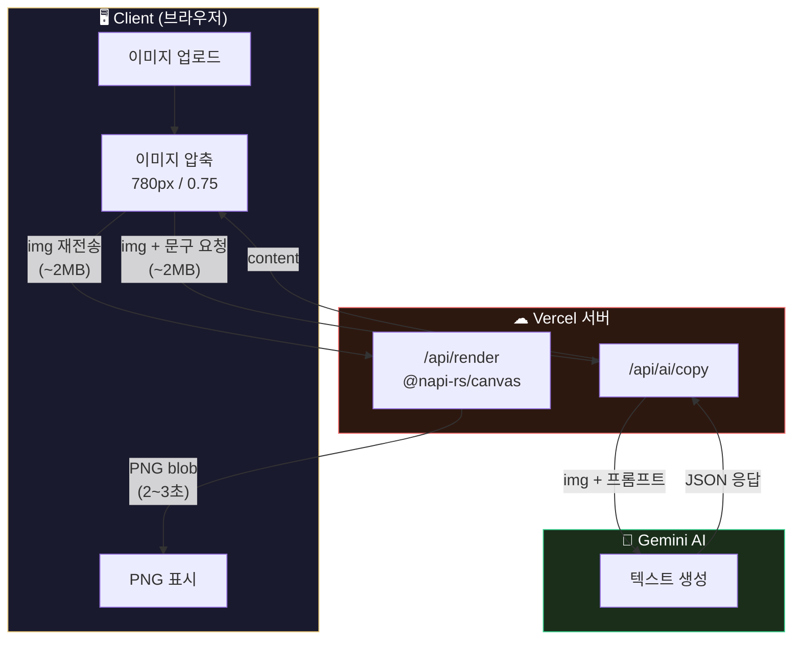
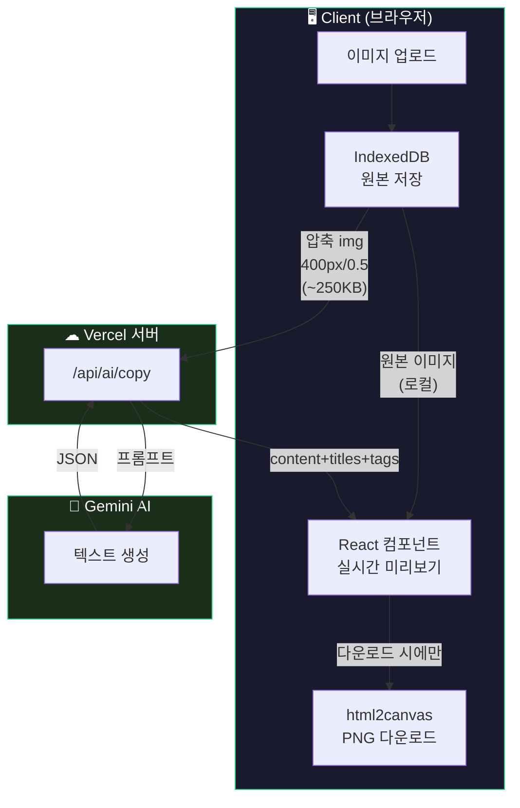

# PageCraft 이슈 트래커

> 해결된 이슈, 개선사항, 아키텍처 변경 기록

---

## #1. Vercel 배포 환경 payload 제한 대응

**오류 텍스트**
```
POST /api/ai/copy 413 (Content Too Large)
ApiError: Request Entity Too Large — FUNCTION_PAYLOAD_TOO_LARGE
```

**문제 상황**
- 상품 이미지 3~4장 이상 업로드 후 상세페이지 생성 버튼 누르면 413 에러 발생
- AI 모델 이미지 생성도 동일하게 실패
- 로컬에서는 정상이지만 Vercel 배포 후에만 발생

**원인**
- Vercel 무료 티어 body 제한: **4.5MB**
- 상품 이미지를 base64 원본으로 서버에 전송 (이미지 1장당 ~200KB~1MB)
- 이미지 10장 + 스토어/약관 이미지 합치면 4.5MB 쉽게 초과
- `next.config.ts`의 `bodySizeLimit` 설정은 Vercel 플랫폼 제한과 무관 (서버 자체 설정일 뿐)

**해결 방법**
- AI 분석용 이미지만 `compressForAI(400px, 0.5)` 압축 후 전송 (최대 5장, ~250KB)
- 상세페이지 렌더링은 클라이언트로 전환하여 서버 전송 자체를 제거 (아래 #2 참고)

**개선 전후 비교**

| | 변경 전 | 변경 후 |
|---|---|---|
| AI 전송 이미지 | 원본 800px, 전체 | 400px/0.5, 최대 5장 |
| AI payload | ~2MB | ~250KB |
| 렌더 전송 이미지 | 원본 → 서버 POST | 전송 없음 (클라이언트 렌더링) |
| Vercel 제한 | 4.5MB에 걸림 | 제한 무관 |

**관련 파일**: `src/lib/image.ts`, `src/components/image/AiModelToggle.tsx`, `src/hooks/useAIGenerate.ts`

---

## #2. 실시간 렌더링 + 상세페이지 품질을 위한 클라이언트/서버 응답 교환 개선

**문제 상황**
- 상세페이지 생성 후 텍스트를 수정하면 "재렌더링" 버튼 → 서버 API 호출 → 2~3초 대기 필요
- 이미지를 서버에 보내야 해서 780px/0.75로 압축 → 상세페이지 이미지 품질 저하
- Vercel 4.5MB 제한 때문에 이미지 장수/해상도에 제약

**배경**
- 기존: 서버(`@napi-rs/canvas`)에서 PNG 렌더링 → 이미지를 base64로 서버에 보내야 함

**해결 방법: 렌더링을 클라이언트(HTML React)로 전환**
-> 이를 통해 직전에 Vercel 제한으로 인한 문제를 회피할수 있겠다는 추가 효과 기대.

**개선 전후 비교**

| | 변경 전 (서버 렌더링) | 변경 후 (클라이언트 렌더링) |
|---|---|---|
| 렌더링 위치 | 서버 (@napi-rs/canvas) | 클라이언트 (HTML React 컴포넌트) |
| 이미지 전송 | base64로 서버에 POST | 전송 없음 (로컬 사용) |
| Vercel 제한 | 4.5MB에 걸림 | API 호출 없음, 제한 무관 |
| 이미지 품질 | 압축 필요 (780px/0.75) | 원본 그대로 (재인코딩 없음) |
| 미리보기 반영 | API 호출 2~3초 | 실시간 즉시 반영 |
| 텍스트 수정 | 수정 → 재렌더링 버튼 → API | 수정 → 자동 반영 |
| 서버 부하 | 렌더링마다 CPU 사용 | 제로 |
| PNG 다운로드 | 서버에서 PNG 반환 | html2canvas로 클라이언트 변환 |

**아키텍처 변경**

### 변경 전 — 서버 렌더링



> 문제: 이미지가 Client ↔ Vercel 사이를 2번 왕복, 압축 필수, Vercel 4.5MB 제한에 걸림

### 변경 후 — 클라이언트 렌더링



> 해결: 이미지는 클라이언트에만 존재, Vercel은 텍스트 중계만, 서버 부하 제로

**단점/주의사항**
- `html2canvas`는 서버 `@napi-rs/canvas`보다 폰트 렌더링이 미세하게 다를 수 있음
- 브라우저별 렌더링 차이 가능성 (크로스 브라우저)
- 서버 렌더링 코드(`render.service.ts`, `/api/render`)는 fallback으로 유지

**관련 파일**:
- `src/components/editor/DetailPagePreview.tsx` (신규)
- `src/app/product/new/page.tsx`
- `src/hooks/useAIGenerate.ts`
- `src/lib/image.ts`
